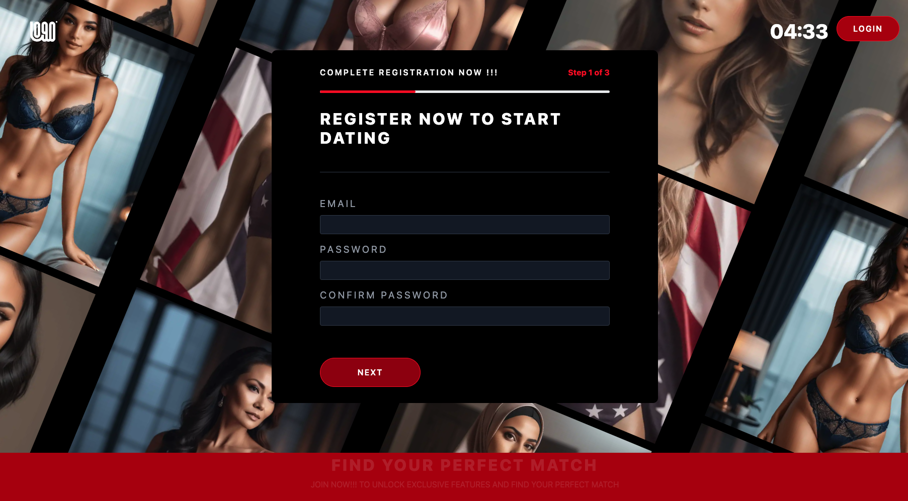
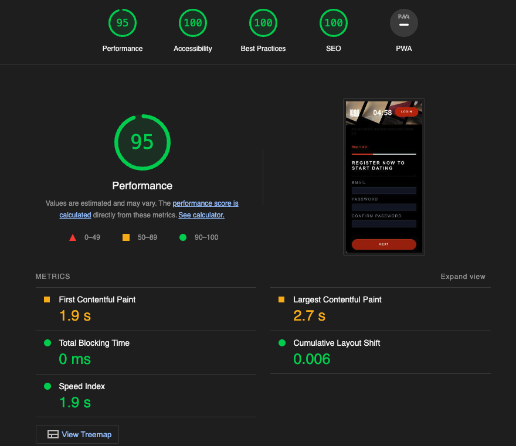

# BD TECH Assessment Submission

## Description

This repository contains my submission for the second technical assessment, which includes HTML, CSS, and JavaScript files as per the coding challenge requirements.

## Hosted Website

Hosted assessment: [Solution URL](https://bd-tech-assessment.vercel.app/)

## Assumptions

1. **Browser Compatibility**: I have tested the landing page on these browsers Brave, Chrome & Safari. I assumed that the coverage should be sufficient and make sure to check my css and HTML for w3 validity. I assumed all the styles that have a 95% score on [Caniuse.com](https://caniuse.com/) and above has a reasonable coverage.  
2. **Responsiveness**: I assumed that mobile first approach would not be necessary because of the basic nature of the website and chose to go desktop first and catered for mobile after.
3. **Functionality**: I assumed that the landing page should meet the functional requirements specified in the coding challenge. I have implemented the required features according to my understanding of the requirements.
4. **Form**: I assumed that the landing page should follow basic security practices such as sanitizing inputs to prevent XSS attacks and ensuring that sensitive data is handled securely. I have implemented basic security measures based on this assumption.
5. **Performance**: I assumed lighthouse is a reasonable indicator of what's acceptable from a performance standpoint and only add behaviour and animations that would affect it's scope for performance.

## QA (Quality Assurance)

I have performed the following QA checks to ensure the quality of the code and landing page:

- **LightHouse performance**: I have ran this through lighthouse to ensure for the best performance. 
- **Manual Testing**: I have manually tested the landing page to ensure that all features work as expected and that there are no visual or functional issues.
- **Cross-browser Testing**: I have tested the landing page on different web browsers to ensure compatibility and consistency in rendering.
- **Responsiveness Testing**: I have tested the landing page on various devices and screen sizes to ensure responsiveness and proper layout.
- **Code Review**: I have reviewed my code to ensure readability, maintainability, and adherence to best practices.
- **Validation**: I have validated the HTML, CSS, and JavaScript code to ensure compliance with standards and to identify any syntax errors or issues.

## Requirements

[Sketch pad](https://link.excalidraw.com/readonly/o63EqJtaRw0KUq1RNgfN)

## Usage

To run the landing page locally:

1. Clone this repository to your local machine.
2. Open the `index.html` file in a web browser.

## Feedback

Thanks for the opportunity and I welcome any feedback. :)